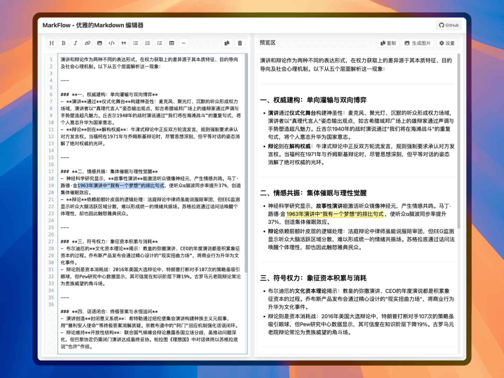

# MarkFlow

> 优雅专业的 Markdown 超轻量编辑器，为开发者、技术写作者和内容创作者提供极致的写作体验，提供 Markdown 转 HTML 富文本和 Markdown 转 PNG 图片导出功能。

## DEMO

## 特色功能

### 专业编辑体验
- **实时双栏预览** - 所见即所得的编辑体验
- **深色模式** - 支持浅色/深色主题切换，自动跟随系统偏好
- **代码高亮** - 支持多种编程语言语法高亮（基于 highlight.js）
- **行号显示** - 精确定位，方便协作
- **字数统计** - 实时显示字数、字符数、预计阅读时间
- **文件拖放** - 拖放 .md 文件直接导入编辑

### 高效工具集
- **快捷工具栏** - 一键插入标题、加粗、斜体、链接、图片、代码块、引用、列表、表格等
- **文本高亮** - 支持 `===高亮===` 语法和选中高亮
- **快捷键支持** - Ctrl+B 加粗、Ctrl+I 斜体、Ctrl+K 链接、Ctrl+H 标题
- **一键复制** - 支持复制 Markdown 源码和 HTML 富文本
- **本地存储** - 自动保存内容，防止意外丢失

### 专业导出功能
- **PDF 导出** - 使用浏览器原生打印，完美支持分页控制
- **图片导出** - 一键导出精美图片，完美还原 Markdown 样式
- **自定义主题** - 多种背景颜色和边框样式
- **水印设置** - 支持自定义水印文本

### 智能特性
- **同步滚动** - 编辑区和预览区同步滚动
- **选中映射** - 编辑区选中文本自动在预览区高亮
- **响应式设计** - 完美适配各种设备

## 快捷键

| 快捷键 | 功能 |
|--------|------|
| Ctrl+B | 加粗 |
| Ctrl+I | 斜体 |
| Ctrl+K | 插入链接 |
| Ctrl+H | 插入标题 |
| Tab | 插入 4 个空格 |

## 适用场景

- **技术文档撰写** - 为开发者提供专业的文档编写工具
- **博客创作** - 为内容创作者提供优雅的写作环境
- **社交媒体** - 导出精美图片分享到公众号、微博等平台
- **学术写作** - 为研究者提供规范的写作格式

## 技术栈

| 技术 | 用途 |
|------|------|
| HTML5 + 原生 JavaScript | 前端核心 |
| Tailwind CSS | 样式框架 |
| Marked.js | Markdown 解析 |
| highlight.js | 代码语法高亮 |
| html2canvas | 图片导出 |
| Font Awesome | 图标库 |

## 快速开始

1. 打开 MarkFlow 网页版
2. 在左侧编辑区输入 Markdown 文本（或拖放 .md 文件）
3. 右侧实时预览渲染效果
4. 使用顶部工具栏快速排版
5. 点击「生成PDF」或「生成图片」导出内容

## 参与贡献

我们欢迎所有形式的贡献，无论是新功能、bug 修复还是文档改进！

1. Fork 本仓库
2. 创建您的特性分支 (`git checkout -b feature/AmazingFeature`)
3. 提交您的更改 (`git commit -m 'Add some AmazingFeature'`)
4. 推送到分支 (`git push origin feature/AmazingFeature`)
5. 打开一个 Pull Request

## 许可证

本项目采用 MIT 许可证 - 查看 [LICENSE](LICENSE) 文件了解详情

## 支持我们

如果您觉得 MarkFlow 对您有帮助，欢迎给我们一个 star

## 更新日志

### 2025年1月29日

- 新增深色模式，支持手动切换和自动跟随系统偏好
- 新增字数统计功能，实时显示字数、字符数、预计阅读时间
- 新增代码语法高亮，支持多种编程语言
- 新增文件拖放导入，支持拖放 .md 文件到编辑器
- 优化 PDF 导出，改用浏览器原生打印，完美支持分页控制
- 修复深色模式下表格表头文字颜色问题
- 修复代码块初始化时主题不正确的问题
- 移除未使用的设置选项（内边距、设备类型）
- 代码优化和清理

### 2025年3月25日

- 修复 PDF 导出时元素被分页截断的问题
- 添加手机框效果，使图片导出更像手机截图
- 解决图片导出时字符重叠问题
- 优化文字渲染和排版

### 2025年1月30日

- 首次发布
- 实现基本的 Markdown 编辑和预览功能
- 添加实时保存功能
- 支持图片和 PDF 导出

## 项目团队

- **吴龙杰** - 项目负责人与主要开发者

---

Made with love by [vorojar](https://github.com/vorojar)
